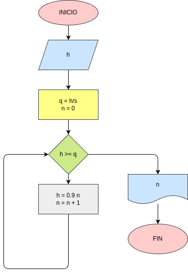

# Calcular_la_altura_h

Una pelota se deja caer desde una altura h, y en cada rebote sube el 10% menos del anterior hacer el diagrama de flujo que lea h y que calcule e emprima en cual rebote la pelota no alcanza a subir la quinta parte de la altura inicial .

# Analisis 

## Input
h
### Variables de entrada 
h = Ingrese la altura inicial de la pelota

# Processing

q = h / 5

n = 0

mientras h > q:

h * 0.9

n + 1

## Output 
n

# Diseño

 

# Construccion 